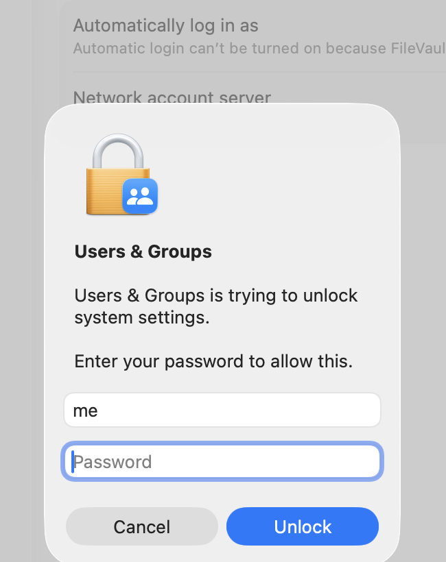
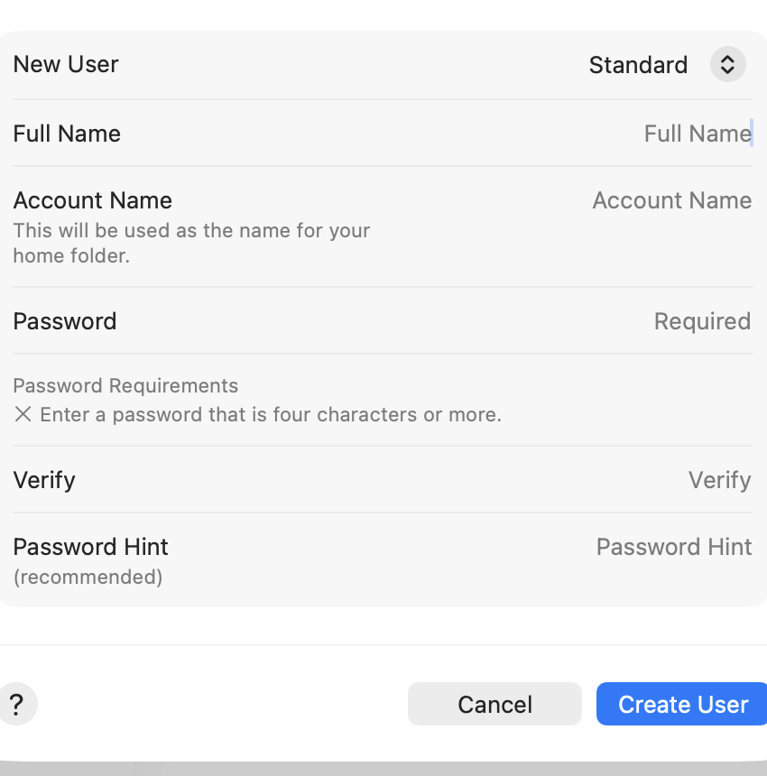

# rrid-ucb/rrid-start

You are joining the rrid development team. This script gets the
`rrid` Mac account far enough to download the private team setup.

You need the GitHub account that was invited to rrid-ucb.

This repo is only `install.sh`. Read it before you run it.

## macOS: add the `rrid` user

Do this while you are still on your everyday Mac account.

1. Open **System Settings**.
2. Open **Users & Groups**.

   

3. Click **Add User…** (you may have to unlock with your own Mac password).

   

   

4. Set **New User** (the menu at the top of the sheet) to **Administrator**.
   Do not leave it on Standard.

5. Set **Full Name** to `rrid` (all lowercase).

6. Set **Account Name** to `rrid` (all lowercase, no spaces, no extra
   characters). This must match exactly.

7. Choose a **Password** you will remember. Confirm it under **Verify**.

8. Click **Create User**.

   

## Turn on Fast User Switching

The menu bar must show the account name so you can switch without logging
out.

1. Open **System Settings → Menu Bar** (on some Macs: **Control Center**).

   

2. Find **Fast User Switching** in the list.

3. Turn the checkbox **on**.

4. Set the menu on the right to **Account Name**.

   

The menu bar (near the clock) now shows your everyday account name:


## Switch into `rrid`

1. Click the account name near the clock.
2. Choose **`rrid`**.
3. Sign in with the password you just set. This is the first login for
   `rrid`.

Open **Terminal** on the `rrid` account (Safari is enough). Paste:

```bash
/bin/bash -c "$(curl -fsSL https://raw.githubusercontent.com/rrid-ucb/rrid-start/main/install.sh)"
```

Sign in to GitHub as **you** when asked. If the clone fails, ask staff: your
GitHub user may not be in rrid-ucb yet.

## Windows

Not written yet. Use a Mac for this setup.
